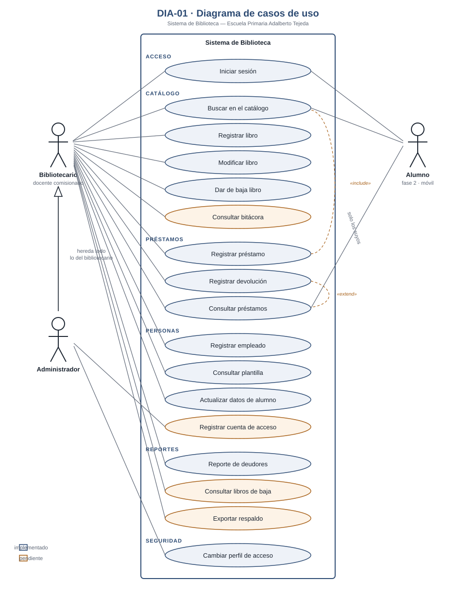

# DIA-01 · Diagrama de casos de uso

> Issue [#59](https://github.com/yaelink7/Biblioteca_Implementacion_Escuela_Primaria/issues/59) · 5 puntos · Pedro Cabrera Barrios Ángel

El diagrama está en [`DIA-01_casos_de_uso.svg`](DIA-01_casos_de_uso.svg). Se abre
en el navegador, en Inkscape o en Word (Insertar → Imagen). Al ser vectorial no
pierde calidad al ampliarlo.

## Los tres actores

| Actor | Quién es | Alcance |
|---|---|---|
| **Bibliotecario** | El docente comisionado que atiende la biblioteca | Todo lo operativo: catálogo, préstamos, padrón, reportes y plantilla |
| **Administrador** | Quien administra el sistema | Hereda todo lo del bibliotecario y añade el cambio de perfiles de acceso |
| **Alumno** | El niño lector | Solo lo suyo. **No necesita cuenta para recibir un préstamo**: el bibliotecario lo registra. Su perfil existe para la aplicación móvil de la fase 2 |

La relación entre Bibliotecario y Administrador es de **generalización**, no de
asociación: el administrador *es* un bibliotecario con dos permisos más. Dibujarlo
así evita repetir quince líneas y refleja cómo lo aplica la base de datos, donde
`es_administrador()` implica `es_personal()`.

## Los diecisiete casos de uso

Cada uno con el requerimiento del Avance que lo respalda:

| Caso de uso | Requisito | Bibliotecario | Administrador | Alumno |
|---|---|:---:|:---:|:---:|
| Iniciar sesión | `REQ-USU-02` | ✓ | ✓ | ✓ |
| Buscar en el catálogo | `REQ-BUS-01`, `REQ-BUS-02` | ✓ | ✓ | ✓ |
| Registrar libro | `REQ-LIB-01` | ✓ | ✓ | |
| Modificar libro | `REQ-LIB-02` | ✓ | ✓ | |
| Dar de baja libro | `REQ-LIB-03` | ✓ | ✓ | |
| Consultar bitácora | `REQ-LIB-04` | ✓ | ✓ | |
| Registrar préstamo | `REQ-PRE-01`, `REQ-PRE-02` | ✓ | ✓ | |
| Registrar devolución | `REQ-PRE-05` | ✓ | ✓ | |
| Consultar préstamos e historial | `REQ-PRE-03`, `REQ-USU-03` | ✓ | ✓ | solo los suyos |
| Registrar empleado | `REQ-EMP-01` | ✓ | ✓ | |
| Consultar plantilla | `REQ-EMP-02` | ✓ | ✓ | |
| Actualizar datos de un alumno | `REQ-EMP-03` | ✓ | ✓ | |
| Registrar cuenta de acceso | `REQ-USU-01` | | ✓ | |
| Reporte de deudores | `REQ-REP-01` | ✓ | ✓ | |
| Consultar libros dados de baja | `REQ-REP-02` | ✓ | ✓ | |
| Exportar respaldo | `REQ-REP-03` | ✓ | ✓ | |
| Cambiar el perfil de acceso de alguien | — | | ✓ | |

Los casos con fondo ámbar en el diagrama —bitácora, cuenta de acceso, libros de
baja y exportación— **están declarados pero aún no implementados**. Se dibujan
porque son requisitos del sistema, no porque funcionen hoy.

## Relaciones entre casos de uso

**`Registrar préstamo` «include» `Buscar en el catálogo`.** No es opcional: el
diálogo de préstamo *es* dos búsquedas y un botón. Buscar al alumno y buscar el
libro son pasos obligatorios del flujo, no casos separados que el bibliotecario
elija.

**`Registrar devolución` «extend» `Consultar préstamos`.** La devolución se hace
desde la lista de préstamos activos, seleccionando uno. Extiende esa consulta
porque solo ocurre a veces y necesita que la consulta ya esté hecha.

**Todos los casos «include» `Iniciar sesión`.** No se dibujan las diecisiete
líneas para no saturar el diagrama, pero la dependencia es real y estricta: sin
sesión, las políticas RLS de PostgreSQL **no devuelven ni una fila**. No es que la
interfaz lo impida; es que la base no responde.

## Nota sobre «Cambiar el perfil de acceso»

El diagrama lo muestra reservado al administrador, que es la intención declarada
en el Avance y en el disparador `proteger_rol`. **Hoy el sistema no lo cumple del
todo**: un bibliotecario puede dar de alta a un empleado con perfil administrador,
porque el disparador solo vigila las modificaciones y no las altas. Está reportado
y pendiente de corregir.

Si el diagrama se entrega antes de esa corrección, lo correcto es dibujar la
intención —como está— y mencionar la excepción en la exposición.
