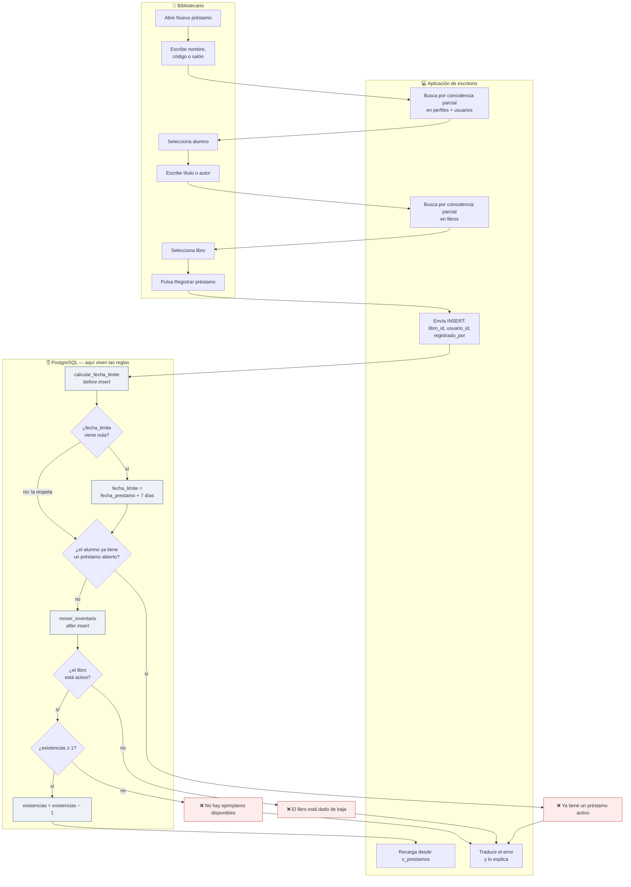
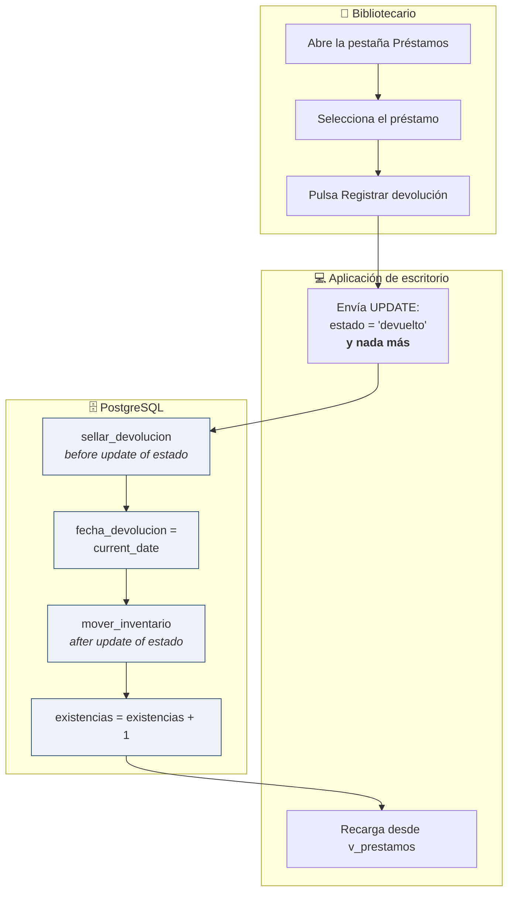
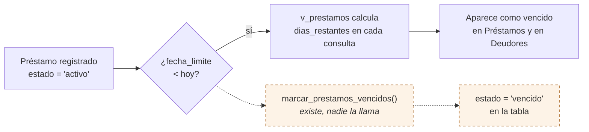

# DIA-03 · Diagrama de proceso

> Issue [#61](https://github.com/yaelink7/Biblioteca_Implementacion_Escuela_Primaria/issues/61) · 5 puntos · Rey David Montes Ciriaco

El proceso de préstamo y devolución **tal como lo ejecuta el sistema**, no como se
planeó. Lo que aparece en el carril de PostgreSQL lo hace la base por su cuenta: el
cliente no lo pide ni puede saltárselo.

## Préstamo

### Tres detalles que el diagrama tiene que mostrar bien

**El orden real.** `calcular_fecha_limite` es `before insert`, así que corre
**antes** de que la fila se materialice y, por tanto, **antes** de que el índice
único evalúe si el alumno ya tiene un préstamo. La fecha se calcula incluso en los
préstamos que van a ser rechazados.

**El plazo se cuenta desde `fecha_prestamo`, no desde hoy.** Y solo se calcula **si
viene nula**: si el cliente envía una fecha límite, el disparador la respeta. Por
eso el diagrama lleva ese nodo de decisión y no una asignación directa.

**El límite es de un préstamo abierto, no de un libro.** El índice único parcial
cubre los estados `activo` y `vencido`. Un alumno con un ejemplar en casa no puede
llevarse otro título, aunque el primero ya esté vencido.

## Devolución

`sellar_devolucion` hace además lo contrario cuando hace falta: si alguien reabre un
préstamo devuelto, **borra** la fecha. No puede existir una devolución sin fecha ni
una fecha sin devolución.

## Vencimiento

**El camino punteado no ocurre todavía.** La función existe pero nadie la programa
(`PRE-05`, issue #33; `pg_cron` no está instalado). En la práctica no se nota
porque las vistas calculan el retraso en cada consulta, así que el reporte de
deudores sale correcto igual. La consecuencia real es que **la columna `estado` no
sirve para saber si un préstamo está vencido**: hay préstamos realmente vencidos
almacenados como `'activo'`.

## Por qué las reglas están en la base y no en la aplicación

Es la decisión que ordena el proyecto. La llave de Supabase que viaja dentro de la
aplicación es pública por diseño: cualquiera puede extraerla y llamar la API
directamente. Una regla que viviera solo en el cliente no sería una regla, sería una
sugerencia.

Además, la aplicación móvil para alumnos de la fase 2 heredará estas reglas sin
tener que reimplementarlas. Por eso el diagrama debe mostrar los rechazos **dentro
del carril de PostgreSQL** y no dentro del de la aplicación.
