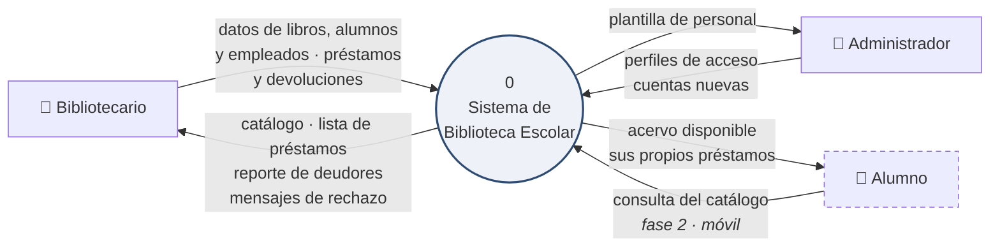
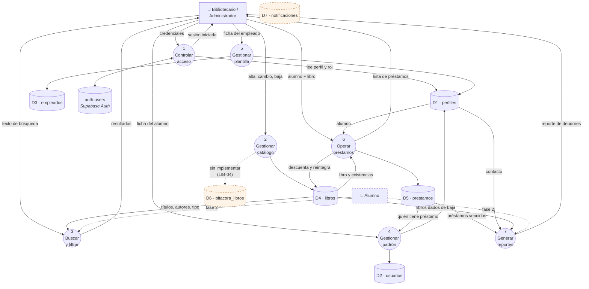

# DIA-04 · Diagrama de flujo de datos

> Issue [#62](https://github.com/yaelink7/Biblioteca_Implementacion_Escuela_Primaria/issues/62) · 5 puntos · Rey David Montes Ciriaco

## Nivel 0 · Diagrama de contexto

El sistema como una sola caja, con quién le habla y qué le dice.

El alumno va punteado: **hoy no interactúa con el sistema**. Su perfil existe y las
políticas de acceso ya lo contemplan, pero la aplicación que usará es la móvil de la
fase 2. En el sistema de escritorio actual, quien teclea siempre es un adulto.

## Nivel 1 · Procesos, almacenes y flujos

## Los siete almacenes

| Almacén | Tabla | Quién escribe | Quién lee |
|---|---|---|---|
| D1 | `perfiles` | Procesos 4 y 5 | 1, 4, 5, 6, 7 |
| D2 | `usuarios` | Proceso 4 | 4, 6 |
| D3 | `empleados` | Proceso 5 | 5 |
| D4 | `libros` | Procesos 2 y 6 | 2, 3, 6, 7 |
| D5 | `prestamos` | Proceso 6 | 4, 6, 7 |
| D6 | `bitacora_libros` | **nadie** | nadie |
| D7 | `notificaciones` | **nadie** | nadie |

**D6 y D7 se dibujan sin flujo de escritura, y está bien así.** Las dos tablas
existen con sus políticas de acceso, y ninguna línea de código escribe en ellas. La
bitácora espera su disparador (`LIB-04`, issue #24); las notificaciones perdieron su
requisito cuando la escuela confirmó que no se comunica por correo con las familias.

Dibujar un almacén al que no llega ninguna flecha **es el diagrama diciendo la
verdad**, y además deja ver el hueco a simple vista.

## Un detalle que suele documentarse mal

El proceso 6 lee `libros` y el proceso 3 también. **Ninguno de los dos usa la vista
`v_catalogo`**, aunque la vista exista para eso: el repositorio consulta la tabla
directamente. Tiene un motivo — la vista filtra `where activo`, y el catálogo
necesita poder mostrar los libros dados de baja cuando se activa esa casilla.

Conviene que el diagrama muestre la tabla y no la vista, porque es lo que ocurre.

## Notas sobre notación

Se usa la notación **Yourdon/DeMarco**: círculos para procesos, rectángulos para
entidades externas, y los almacenes con su identificador `Dn`. Si el profesor pide
Gane-Sarson, los procesos van en rectángulos redondeados y los almacenes en
rectángulos abiertos a la derecha; el contenido no cambia.

Los flujos del nivel 1 conservan la numeración del nivel 0: todo lo que entra y sale
de la caja única del contexto tiene su correspondencia aquí, sin flujos nuevos ni
perdidos.
