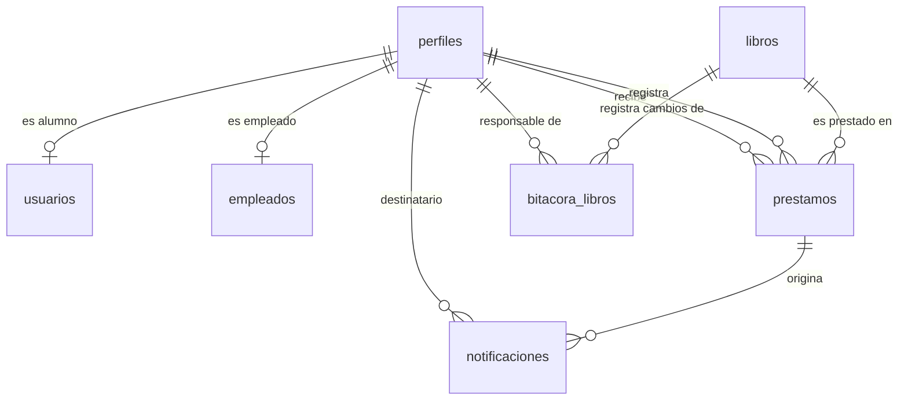

# DIA-05 · Modelado de base de datos

> Issue [#63](https://github.com/yaelink7/Biblioteca_Implementacion_Escuela_Primaria/issues/63) · 5 puntos · Pedro Cabrera Barrios Ángel

El modelo **físico**: las siete tablas con sus columnas, tipos y restricciones tal
como corren hoy en PostgreSQL 17. Sacado de las nueve migraciones de
`database/migraciones/`, no de la documentación.

> **Los UML del repositorio Java ya no corresponden.** Cambió el esquema, apareció
> la capa de servicios y las reglas se movieron a la base. Partir de ellos produce
> un diagrama equivocado.

## Vista general



## Las siete tablas

### `perfiles` — lo común a toda persona

| Columna | Tipo | Restricciones |
|---|---|---|
| `id` | `uuid` | **PK**, `default gen_random_uuid()` |
| `auth_id` | `uuid` | **FK** → `auth.users(id)` `ON DELETE SET NULL`, `unique`, admite nulo |
| `rol` | `rol_usuario` | `not null`, `default 'alumno'` |
| `codigo` | `text` | `not null`, `unique` |
| `nombre` | `text` | `not null`, `check` no vacío |
| `apellido` | `text` | `not null`, `check` no vacío |
| `calle` · `colonia` | `text` | |
| `numero` | `integer` | |
| `codigo_postal` | `text` | **texto**, para conservar los ceros a la izquierda |
| `telefono` | `text` | **texto**, no es un valor aritmético |
| `correo` | `text` | admite nulo, `check` de formato |
| `activo` | `boolean` | `not null`, `default true` |
| `creado_en` · `actualizado_en` | `timestamptz` | `not null`, `default now()` |

`auth_id` admite nulo **a propósito**: un alumno de primaria tiene ficha sin tener
cuenta. El bibliotecario lo registra y le presta libros sin que el niño tenga correo
ni contraseña.

### `usuarios` y `empleados` — lo propio de cada tipo

```
usuarios                                 empleados
  perfil_id  uuid  PK, FK → perfiles       perfil_id      uuid  PK, FK → perfiles
                   ON DELETE CASCADE                            ON DELETE CASCADE
  grado      smallint  check 1..6          tipo_empleado  text  not null
  grupo      text      check ≤ 4 car.      fecha_ingreso  date  not null
                                                                default current_date
```

Las dos **comparten la llave primaria con `perfiles`**. Es herencia por tabla, una
relación 1:0..1: una persona es alumno o empleado, nunca las dos, y puede ser
ninguna de las dos mientras su ficha exista.

### `libros` — el catálogo

| Columna | Tipo | Restricciones |
|---|---|---|
| `id` | `bigint` | **PK**, `generated always as identity` |
| `titulo` · `autor` | `text` | `not null`, `check` no vacío |
| `tipo_libro` · `editorial` | `text` | |
| `existencias` | `integer` | `not null`, `default 0`, `check (>= 0)` |
| `ano_publicacion` | `smallint` | validado por disparador |
| `num_paginas` | `integer` | `check (> 0)` si no es nulo |
| `activo` | `boolean` | `not null`, `default true` — baja lógica |
| `motivo_baja` | `text` | |
| `dado_baja_en` | `timestamptz` | |
| `creado_en` · `actualizado_en` | `timestamptz` | `not null`, `default now()` |

`constraint baja_con_motivo`: si el libro no está activo, exige motivo **y** fecha.
No se puede dar de baja sin decir por qué.

**No hay columna `disponible`.** Se deduce de las existencias. El sistema Java la
almacenaba y podía contradecir al inventario: era el defecto D-09.

### `prestamos` — el corazón del sistema

| Columna | Tipo | Restricciones |
|---|---|---|
| `id` | `bigint` | **PK**, `generated always as identity` |
| `libro_id` | `bigint` | `not null`, **FK** → `libros(id)` **`ON DELETE RESTRICT`** |
| `usuario_id` | `uuid` | `not null`, **FK** → `perfiles(id)` **`ON DELETE RESTRICT`** |
| `registrado_por` | `uuid` | **FK** → `perfiles(id)` `ON DELETE SET NULL` |
| `fecha_prestamo` | `date` | `not null`, `default current_date` |
| `fecha_limite` | `date` | `not null` — la pone el disparador |
| `fecha_devolucion` | `date` | admite nulo — la pone el disparador |
| `estado` | `estado_prestamo` | `not null`, `default 'activo'` |
| `creado_en` | `timestamptz` | `not null`, `default now()` |

```sql
constraint devolucion_coherente          -- devuelto ⇔ tiene fecha de devolución

create unique index prestamo_unico_activo_por_usuario
  on public.prestamos (usuario_id)
  where estado in ('activo', 'vencido');
```

**Ese índice único parcial *es* la regla de un libro por alumno.** No hay código que
la verifique: la base rechaza el segundo préstamo. Cubre los dos estados abiertos y
deja libre el cerrado, de modo que un alumno que ya devolvió puede llevarse otro.

**`RESTRICT` y no `CASCADE`** es deliberado. `REQ-PRE-03` exige conservar el
historial; borrar en cascada lo destruiría, que es exactamente lo que hacía el
sistema Java.

### `bitacora_libros` y `notificaciones` — existen, nadie escribe en ellas

```
bitacora_libros                           notificaciones
  id           bigint PK                    id            bigint PK
  libro_id     FK → libros  CASCADE         perfil_id     FK → perfiles CASCADE
  perfil_id    FK → perfiles SET NULL       prestamo_id   FK → prestamos SET NULL
  accion       check alta|modificacion|     tipo          check vencimiento_proximo|
                     baja                                       prestamo_vencido|
  datos_antes   jsonb                                            libro_disponible
  datos_despues jsonb                       destinatario  text not null
  ocurrido_en   timestamptz                 estado        check pendiente|enviada|
                                                                 fallida
                                            detalle · enviada_en · creada_en
```

`bitacora_libros` espera su disparador (`LIB-04`, issue #24). `notificaciones`
quedó sin requisito que la respalde: `REQ-PRE-04` se retiró cuando la escuela
confirmó que no se comunica por correo con las familias.

## Dos tipos enumerados

```sql
create type public.rol_usuario     as enum ('administrador', 'bibliotecario', 'alumno');
create type public.estado_prestamo as enum ('activo', 'devuelto', 'vencido');
```

El orden importa: en PostgreSQL define cómo se comparan y cómo ordena un `ORDER BY`.

## Qué reglas viven como disparador y no como código

Es lo que distingue este modelo de uno convencional, y conviene que el diagrama lo
señale:

| Regla | Objeto de la base | Requisito |
|---|---|---|
| Un préstamo abierto por alumno | Índice único parcial | `REQ-PRE-01` |
| Plazo de siete días | `calcular_fecha_limite` | `REQ-PRE-02` |
| Movimiento de inventario | `mover_inventario` | `REQ-PRE-01` |
| No dar de baja con préstamos vivos | `validar_baja_de_libro` | `REQ-LIB-03` |
| Año de publicación válido | `validar_ano_publicacion` | `REQ-LIB-01` |
| Fecha de devolución | `sellar_devolucion` | — |
| Solo el administrador cambia perfiles | `proteger_rol` | — |
| Altas y cambios atómicos de personas | `registrar_*`, `actualizar_alumno` | — |
| Acceso por perfil | 16 políticas RLS | Factibilidad Legal |

## Las cuatro vistas de reporte

| Vista | Qué responde |
|---|---|
| `v_catalogo` | El acervo activo con la disponibilidad deducida de las existencias |
| `v_prestamos` | Préstamos con `dias_restantes` calculado por la base |
| `v_deudores` | Quién debe, desde cuándo, y cómo localizarlo |
| `v_libros_faltantes` | Libros dados de baja, con su motivo y fecha |

Las cuatro con `security_invoker = on`, para que respeten las políticas de acceso de
quien consulta y no las de quien las creó.

---

> **Aviso de vigencia.** Siete de las ocho historias de la reunión con la escuela
> (issues #72 a #79) modifican este esquema: colección del libro restringida a las
> cinco de Libros del Rincón, asignatura, CURP, maestro de grupo, datos del tutor,
> retiro del correo del alumno, costo de reposición y cuatro vistas de estadísticas.
> Este modelo habrá que actualizarlo después de la migración 10.
