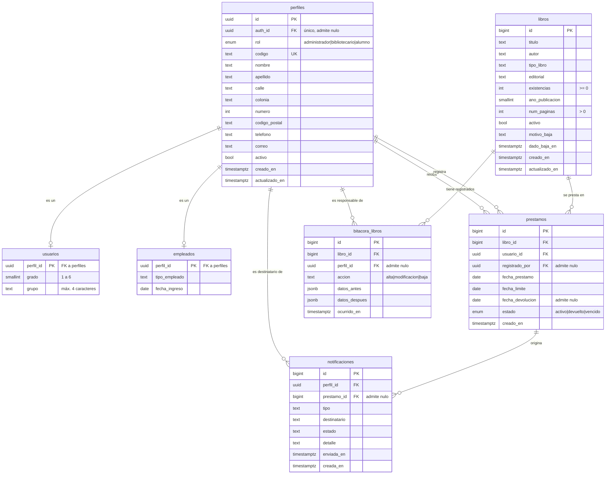

# DIA-06 · Modelo entidad-relación y modelo relacional

> Issue [#64](https://github.com/yaelink7/Biblioteca_Implementacion_Escuela_Primaria/issues/64) · 8 puntos · Pedro Cabrera Barrios Ángel

Las dos partes del modelado que el profesor agrupa con una llave: primero el E-R
conceptual, después su traducción al modelo relacional.

## 1 · Modelo entidad-relación

### Las nueve relaciones, con su cardinalidad

| Relación | Cardinalidad | Qué significa |
|---|---|---|
| `perfiles` – `usuarios` | 1 : 0..1 | Un perfil es alumno, o no lo es |
| `perfiles` – `empleados` | 1 : 0..1 | Un perfil es empleado, o no lo es |
| `perfiles` – `prestamos` (`usuario_id`) | 1 : 0..N | Un alumno recibe muchos préstamos a lo largo del tiempo, **pero solo uno abierto a la vez** |
| `perfiles` – `prestamos` (`registrado_por`) | 1 : 0..N | Quién capturó el préstamo. Admite nulo: el préstamo sobrevive si ese empleado se da de baja |
| `libros` – `prestamos` | 1 : 0..N | El historial completo del ejemplar |
| `libros` – `bitacora_libros` | 1 : 0..N | Los cambios registrados de ese libro |
| `perfiles` – `bitacora_libros` | 1 : 0..N | Quién hizo cada cambio |
| `perfiles` – `notificaciones` | 1 : 0..N | A quién se le avisó |
| `prestamos` – `notificaciones` | 1 : 0..N | Por qué préstamo se avisó |

**Hay dos relaciones distintas entre `perfiles` y `prestamos`**, y conviene que el
diagrama las distinga: quién se lleva el libro, y quién capturó la operación. No son
la misma persona.

### La restricción que el E-R no puede expresar

«Un solo préstamo abierto por alumno» **no es una cardinalidad**: es una restricción
sobre un subconjunto de filas. En el E-R se anota como nota adjunta a la relación
*recibe*, y en el modelo relacional se implementa con un índice único parcial.

Vale la pena señalarlo en la exposición: es el ejemplo más claro de una regla de
negocio que la base impone y que ningún diagrama conceptual captura por sí solo.

### Especialización

`usuarios` y `empleados` son una **especialización** de `perfiles`: comparten su
llave primaria. Es disjunta (nadie es las dos cosas) y parcial (un perfil puede no
ser ninguna, mientras su ficha existe sin tipo asignado).

## 2 · Modelo relacional

Notación: **subrayado** = llave primaria · *cursiva* = llave foránea

> **perfiles** ( <u>id</u>, *auth_id*, rol, codigo, nombre, apellido, calle, colonia, numero, codigo_postal, telefono, correo, activo, creado_en, actualizado_en )
>
> **usuarios** ( <u>*perfil_id*</u>, grado, grupo )
>
> **empleados** ( <u>*perfil_id*</u>, tipo_empleado, fecha_ingreso )
>
> **libros** ( <u>id</u>, titulo, autor, tipo_libro, editorial, existencias, ano_publicacion, num_paginas, activo, motivo_baja, dado_baja_en, creado_en, actualizado_en )
>
> **prestamos** ( <u>id</u>, *libro_id*, *usuario_id*, *registrado_por*, fecha_prestamo, fecha_limite, fecha_devolucion, estado, creado_en )
>
> **bitacora_libros** ( <u>id</u>, *libro_id*, *perfil_id*, accion, datos_antes, datos_despues, ocurrido_en )
>
> **notificaciones** ( <u>id</u>, *perfil_id*, *prestamo_id*, tipo, destinatario, estado, detalle, enviada_en, creada_en )

### Llaves foráneas y su comportamiento al borrar

| Tabla | Columna | Referencia | ON DELETE | Por qué |
|---|---|---|---|---|
| `perfiles` | `auth_id` | `auth.users(id)` | `SET NULL` | Borrar la cuenta no borra la ficha de la persona |
| `usuarios` | `perfil_id` | `perfiles(id)` | `CASCADE` | Sin perfil no hay alumno |
| `empleados` | `perfil_id` | `perfiles(id)` | `CASCADE` | Sin perfil no hay empleado |
| `prestamos` | `libro_id` | `libros(id)` | **`RESTRICT`** | El historial no se borra: `REQ-PRE-03` |
| `prestamos` | `usuario_id` | `perfiles(id)` | **`RESTRICT`** | Ídem |
| `prestamos` | `registrado_por` | `perfiles(id)` | `SET NULL` | El préstamo sobrevive a la baja del empleado |
| `bitacora_libros` | `libro_id` | `libros(id)` | `CASCADE` | |
| `bitacora_libros` | `perfil_id` | `perfiles(id)` | `SET NULL` | |
| `notificaciones` | `perfil_id` | `perfiles(id)` | `CASCADE` | |
| `notificaciones` | `prestamo_id` | `prestamos(id)` | `SET NULL` | |

### Restricciones de unicidad

| Tabla | Restricción | Alcance |
|---|---|---|
| `perfiles` | `codigo` | `UNIQUE` sobre toda la tabla |
| `perfiles` | `auth_id` | `UNIQUE`, admite varios nulos |
| `prestamos` | `usuario_id` | **`UNIQUE` parcial**: solo donde `estado in ('activo','vencido')` |

### Restricciones de dominio

| Tabla | Restricción |
|---|---|
| `perfiles` | `nombre` y `apellido` no vacíos · `correo` con formato válido si no es nulo |
| `usuarios` | `grado` entre 1 y 6 · `grupo` de 4 caracteres como máximo |
| `libros` | `titulo` y `autor` no vacíos · `existencias >= 0` · `num_paginas > 0` si no es nulo |
| `libros` | `baja_con_motivo`: si `activo = false`, exige `motivo_baja` y `dado_baja_en` |
| `prestamos` | `devolucion_coherente`: `estado = 'devuelto'` si y solo si hay `fecha_devolucion` |
| `bitacora_libros` | `accion` ∈ {alta, modificacion, baja} |
| `notificaciones` | `tipo` ∈ {vencimiento_proximo, prestamo_vencido, libro_disponible} · `estado` ∈ {pendiente, enviada, fallida} |

### Normalización

El esquema está en **tercera forma normal**:

- **1FN** — todos los atributos son atómicos. `datos_antes` y `datos_despues` son
  `jsonb`, que parece una excepción, pero es un documento de auditoría, no un
  conjunto de atributos consultables.
- **2FN** — no hay llaves compuestas, así que no puede haber dependencias parciales.
- **3FN** — ningún atributo no clave depende de otro no clave. El caso que lo habría
  roto era la columna `Disponible` del sistema Java, que dependía de `existencias`:
  se eliminó y hoy se deduce en `v_catalogo`.

La denormalización que sí existe es deliberada y vive en las vistas: `v_deudores`
repite el nombre del alumno y el título del libro para que el reporte salga en una
sola consulta.

---

> **Aviso de vigencia.** Los issues #72 a #79 modifican este modelo. Conviene
> actualizarlo después de la migración 10.
