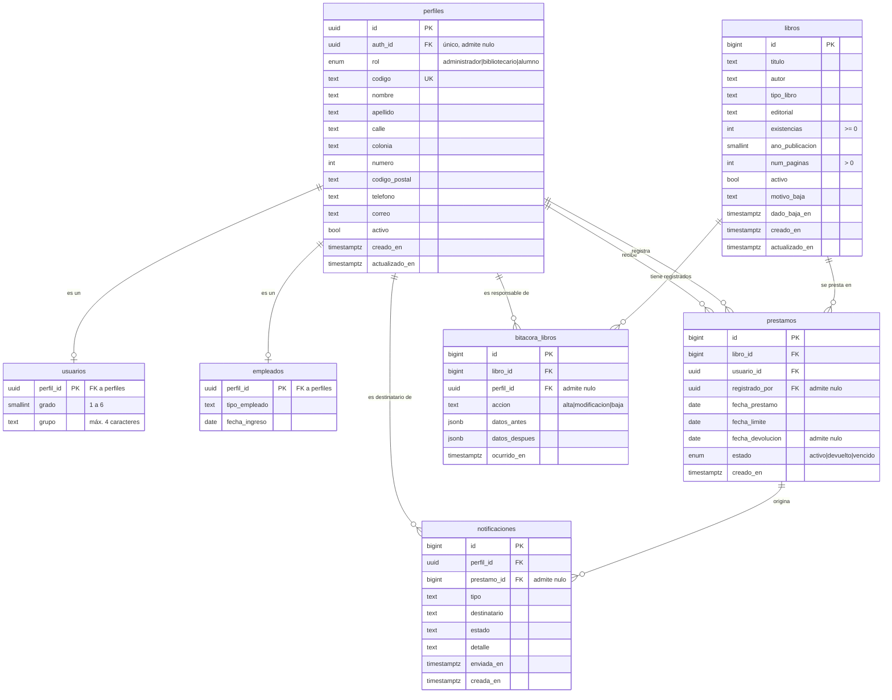

# DIA-06a · Modelo entidad-relación

> Issue [#64](https://github.com/yaelink7/Biblioteca_Implementacion_Escuela_Primaria/issues/64) · Pedro Cabrera Barrios Ángel
> Primera parte del entregable. La segunda es [DIA-06b · Modelo relacional](DIA-06b_modelo_relacional.md).

El modelo **conceptual**: qué entidades existen, qué guarda cada una y cómo se
relacionan. Todavía sin decidir cómo se implementa.

## Las siete entidades

| Entidad | Qué representa |
|---|---|
| `perfiles` | Toda persona del sistema, sea alumno o empleado |
| `usuarios` | La parte de un perfil que solo tiene un alumno: grado y grupo |
| `empleados` | La parte que solo tiene un empleado: puesto y fecha de ingreso |
| `libros` | Cada título del acervo, con sus ejemplares |
| `prestamos` | Cada préstamo y su ciclo hasta la devolución |
| `bitacora_libros` | El registro de cambios del catálogo |
| `notificaciones` | Los avisos a las familias |

## Las nueve relaciones, con su cardinalidad

| Relación | Cardinalidad | Qué significa |
|---|---|---|
| `perfiles` – `usuarios` | 1 : 0..1 | Un perfil es alumno, o no lo es |
| `perfiles` – `empleados` | 1 : 0..1 | Un perfil es empleado, o no lo es |
| `perfiles` – `prestamos` · *recibe* | 1 : 0..N | Un alumno recibe muchos préstamos con el tiempo, **pero solo uno abierto a la vez** |
| `perfiles` – `prestamos` · *registra* | 1 : 0..N | Qué empleado capturó la operación |
| `libros` – `prestamos` | 1 : 0..N | El historial completo del ejemplar |
| `libros` – `bitacora_libros` | 1 : 0..N | Los cambios registrados de ese libro |
| `perfiles` – `bitacora_libros` | 1 : 0..N | Quién hizo cada cambio |
| `perfiles` – `notificaciones` | 1 : 0..N | A quién se le avisó |
| `prestamos` – `notificaciones` | 1 : 0..N | Por qué préstamo se avisó |

**Hay dos relaciones distintas entre `perfiles` y `prestamos`**, y el diagrama debe
distinguirlas: quién se lleva el libro, y quién capturó la operación. No son la misma
persona, y confundirlas sería perder la trazabilidad de quién prestó qué.

## Especialización

`usuarios` y `empleados` son una **especialización** de `perfiles`. Es:

- **Disjunta** — nadie es alumno y empleado a la vez.
- **Parcial** — un perfil puede no ser ninguna de las dos mientras su ficha existe
  sin tipo asignado.

Se modela así porque las dos comparten todos los datos de contacto y solo difieren
en dos o tres atributos propios. Repetir nombre, apellido, teléfono y dirección en
dos entidades habría roto la tercera forma normal.

## La restricción que el E-R no puede expresar

**«Un solo préstamo abierto por alumno» no es una cardinalidad.** La cardinalidad
entre `perfiles` y `prestamos` es 1:N —un alumno recibe muchos préstamos a lo largo
del ciclo escolar—; lo que está limitado es cuántos puede tener **abiertos al mismo
tiempo**, y eso es una restricción sobre un subconjunto de filas.

En el E-R se anota como nota adjunta a la relación *recibe*. En el modelo relacional
se implementa con un índice único parcial, y ahí sí se puede ver — está dibujado en
[DIA-06b](DIA-06b_modelo_relacional.md).

Vale la pena señalarlo en la exposición: es el ejemplo más claro de una regla de
negocio que la base impone y que ningún diagrama conceptual captura por sí solo.

## Un atributo que no existe, y es deliberado

`libros` **no tiene un atributo `disponible`**. Sería derivable de `existencias`, y
por tanto una violación de la tercera forma normal. El sistema Java lo almacenaba y
podía contradecir al inventario: fue el defecto D-09 de la auditoría de calidad.

Aquí la disponibilidad se deduce cuando se consulta, en la vista `v_catalogo`.

---

> **Aviso de vigencia.** Los issues #72 a #79 modifican este modelo: colección del
> libro, asignatura, CURP, maestro de grupo, datos del tutor, retiro del correo del
> alumno y costo de reposición. Conviene actualizarlo después de la migración 10.
