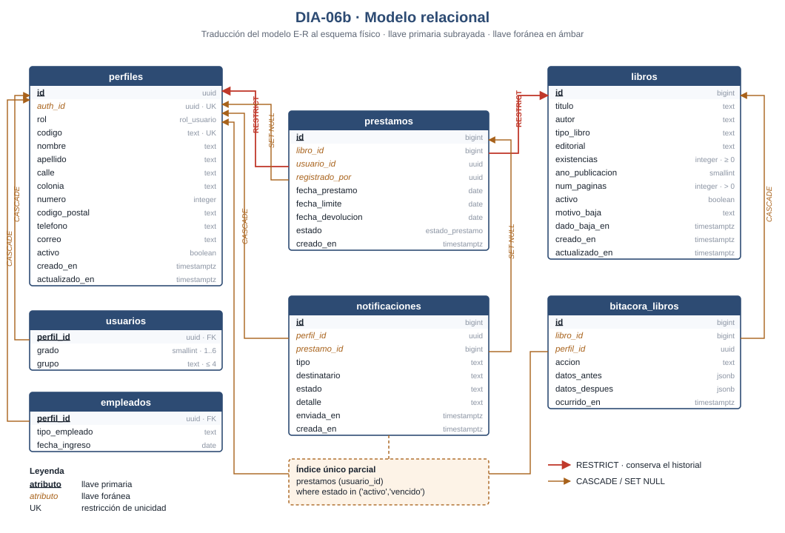

# DIA-06b · Modelo relacional

> Issue [#64](https://github.com/yaelink7/Biblioteca_Implementacion_Escuela_Primaria/issues/64) · Pedro Cabrera Barrios Ángel
> Segunda parte del entregable. La primera es [DIA-06a · Modelo entidad-relación](DIA-06a_modelo_entidad_relacion.md).

La traducción del E-R al esquema físico: las siete relaciones con sus llaves, y qué
pasa con cada referencia cuando se borra la fila a la que apunta.

El diagrama está en [`DIA-06b_modelo_relacional.svg`](DIA-06b_modelo_relacional.svg).



## Notación del diagrama

| Marca | Significa |
|---|---|
| **Subrayado** | Llave primaria |
| *Ámbar en cursiva* | Llave foránea |
| `UK` | Restricción de unicidad adicional |
| Flecha roja | `ON DELETE RESTRICT` — impide el borrado |
| Flecha ámbar | `ON DELETE CASCADE` o `SET NULL` |

## Las siete relaciones

> **perfiles** ( <u>id</u>, *auth_id*, rol, codigo, nombre, apellido, calle, colonia, numero, codigo_postal, telefono, correo, activo, creado_en, actualizado_en )
>
> **usuarios** ( <u>*perfil_id*</u>, grado, grupo )
>
> **empleados** ( <u>*perfil_id*</u>, tipo_empleado, fecha_ingreso )
>
> **libros** ( <u>id</u>, titulo, autor, tipo_libro, editorial, existencias, ano_publicacion, num_paginas, activo, motivo_baja, dado_baja_en, creado_en, actualizado_en )
>
> **prestamos** ( <u>id</u>, *libro_id*, *usuario_id*, *registrado_por*, fecha_prestamo, fecha_limite, fecha_devolucion, estado, creado_en )
>
> **bitacora_libros** ( <u>id</u>, *libro_id*, *perfil_id*, accion, datos_antes, datos_despues, ocurrido_en )
>
> **notificaciones** ( <u>id</u>, *perfil_id*, *prestamo_id*, tipo, destinatario, estado, detalle, enviada_en, creada_en )

## Cómo se tradujo cada construcción del E-R

| En el E-R | En el relacional |
|---|---|
| Especialización `perfiles` → `usuarios` / `empleados` | Dos relaciones que **comparten la llave primaria** con la general. No hay atributo discriminador: la presencia de la fila es el discriminador |
| Relación 1:N *recibe* | Llave foránea `usuario_id` en el lado N |
| Relación 1:N *registra* | Segunda llave foránea `registrado_por`, hacia la misma relación |
| «Solo un préstamo abierto por alumno» | **Índice único parcial** sobre `usuario_id`, limitado a los estados abiertos |
| Atributo derivado *disponible* | **No se materializa.** Se calcula en la vista `v_catalogo` |

## Llaves foráneas y su comportamiento al borrar

| Relación | Atributo | Referencia | ON DELETE | Por qué |
|---|---|---|---|---|
| `perfiles` | `auth_id` | `auth.users(id)` | `SET NULL` | Borrar la cuenta no borra la ficha de la persona |
| `usuarios` | `perfil_id` | `perfiles(id)` | `CASCADE` | Sin perfil no hay alumno |
| `empleados` | `perfil_id` | `perfiles(id)` | `CASCADE` | Sin perfil no hay empleado |
| `prestamos` | `libro_id` | `libros(id)` | **`RESTRICT`** | El historial no se borra: `REQ-PRE-03` |
| `prestamos` | `usuario_id` | `perfiles(id)` | **`RESTRICT`** | Ídem |
| `prestamos` | `registrado_por` | `perfiles(id)` | `SET NULL` | El préstamo sobrevive a la baja del empleado que lo capturó |
| `bitacora_libros` | `libro_id` | `libros(id)` | `CASCADE` | |
| `bitacora_libros` | `perfil_id` | `perfiles(id)` | `SET NULL` | |
| `notificaciones` | `perfil_id` | `perfiles(id)` | `CASCADE` | |
| `notificaciones` | `prestamo_id` | `prestamos(id)` | `SET NULL` | |

**Las dos flechas rojas del diagrama son la decisión más importante de esta tabla.**
`REQ-PRE-03` exige conservar el historial de préstamos de forma permanente. Con
`CASCADE`, borrar un libro o una persona se llevaría por delante todo su historial;
con `RESTRICT`, la base **impide** ese borrado. El sistema Java usaba `CASCADE` y por
eso perdía historial — está registrado entre las correcciones al diseño heredado.

## Restricciones de unicidad

| Relación | Atributos | Alcance |
|---|---|---|
| `perfiles` | `codigo` | `UNIQUE` sobre toda la relación |
| `perfiles` | `auth_id` | `UNIQUE`, admite varios nulos |
| `prestamos` | `usuario_id` | **`UNIQUE` parcial**: solo donde `estado in ('activo','vencido')` |

```sql
create unique index prestamo_unico_activo_por_usuario
  on public.prestamos (usuario_id)
  where estado in ('activo', 'vencido');
```

Ese índice **es** la regla de un libro por alumno. No hay código que la verifique: la
base rechaza el segundo préstamo. Cubre los dos estados abiertos y deja libre el
cerrado, de modo que un alumno que ya devolvió puede llevarse otro.

## Restricciones de dominio

| Relación | Restricción |
|---|---|
| `perfiles` | `nombre` y `apellido` no vacíos · `correo` con formato válido si no es nulo |
| `usuarios` | `grado` entre 1 y 6 · `grupo` de 4 caracteres como máximo |
| `libros` | `titulo` y `autor` no vacíos · `existencias >= 0` · `num_paginas > 0` si no es nulo |
| `libros` | `baja_con_motivo`: si `activo = false`, exige `motivo_baja` y `dado_baja_en` |
| `prestamos` | `devolucion_coherente`: `estado = 'devuelto'` si y solo si hay `fecha_devolucion` |
| `bitacora_libros` | `accion` ∈ {alta, modificacion, baja} |
| `notificaciones` | `tipo` ∈ {vencimiento_proximo, prestamo_vencido, libro_disponible} · `estado` ∈ {pendiente, enviada, fallida} |

Dos decisiones de tipo que conviene explicar, porque parecen errores y no lo son:

**`codigo_postal` es texto, no número.** Un código como `04600` perdería el cero a la
izquierda si fuera numérico. **`telefono` también es texto**: no es un valor
aritmético y puede traer espacios o guiones. En el sistema Java los dos eran
numéricos, y está entre las correcciones al diseño heredado.

## Normalización

El esquema está en **tercera forma normal**:

- **1FN** — todos los atributos son atómicos. `datos_antes` y `datos_despues` son
  `jsonb`, que parece una excepción, pero es un documento de auditoría completo, no
  un conjunto de atributos consultables por separado.
- **2FN** — no hay llaves primarias compuestas, así que no puede haber dependencias
  parciales.
- **3FN** — ningún atributo no clave depende de otro no clave. El caso que lo habría
  roto era la columna `Disponible` del sistema Java, que dependía de `existencias`:
  se eliminó y hoy se deduce en `v_catalogo`.

La denormalización que sí existe es deliberada y vive en las vistas, no en las
tablas: `v_deudores` repite el nombre del alumno y el título del libro para que el
reporte salga en una sola consulta.

---

> **Aviso de vigencia.** Los issues #72 a #79 modifican este esquema. Conviene
> actualizarlo después de la migración 10.
