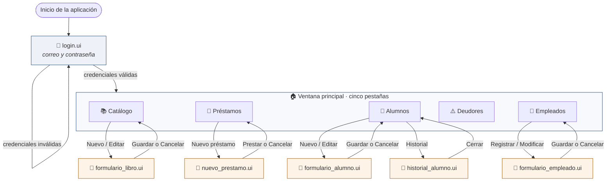

# DIA-08 · Diagramas de interfaces

> Issue [#66](https://github.com/yaelink7/Biblioteca_Implementacion_Escuela_Primaria/issues/66) · 5 puntos · Rey David Montes Ciriaco

Las once pantallas del sistema, la navegación entre ellas y de dónde saca cada una
sus datos. Los diseños viven en `src/biblioteca/ui/disenos/` como archivos `.ui` y se
editan en Qt Designer.

## Navegación



Las cinco pestañas **conviven en una sola ventana**: cambiar de pestaña no cierra
nada ni pierde el trabajo. Los cinco diálogos en ámbar son **modales**: hay que
resolverlos antes de volver.

No hay forma de llegar a ninguna pantalla sin pasar por el inicio de sesión, y no es
solo la interfaz: sin sesión, las políticas de la base no devuelven ni una fila.

## Las once pantallas

| # | Pantalla | Archivo | Tipo | Requisito |
|---|---|---|---|---|
| 1 | Inicio de sesión | `login.ui` | Ventana | `REQ-USU-02` |
| 2 | Ventana principal | — (código) | Ventana | — |
| 3 | Catálogo | `catalogo.ui` | Pestaña | `REQ-LIB-01/02/03`, `REQ-BUS-01/02` |
| 4 | Préstamos | `prestamos.ui` | Pestaña | `REQ-PRE-02/03/05` |
| 5 | Alumnos | `alumnos.ui` | Pestaña | `REQ-EMP-03` |
| 6 | Deudores | `deudores.ui` | Pestaña | `REQ-REP-01` |
| 7 | Empleados | `empleados.ui` | Pestaña | `REQ-EMP-01/02` |
| 8 | Formulario de libro | `formulario_libro.ui` | Diálogo | `REQ-LIB-01/02` |
| 9 | Nuevo préstamo | `nuevo_prestamo.ui` | Diálogo | `REQ-PRE-01` |
| 10 | Formulario de alumno | `formulario_alumno.ui` | Diálogo | `REQ-EMP-03` |
| 11 | Formulario de empleado | `formulario_empleado.ui` | Diálogo | `REQ-EMP-01` |
| 12 | Historial del alumno | `historial_alumno.ui` | Diálogo | `REQ-USU-03` |

## Controles y origen de los datos

| Pantalla | Controles | De dónde saca los datos |
|---|---|---|
| **Inicio de sesión** | `campoCorreo`, `campoContrasena`, `botonEntrar` | Supabase Auth + `perfiles` |
| **Catálogo** | `campoBusqueda`, `casillaVerBajas`, `tablaLibros` (ordenable), `botonNuevo`, `botonEditar`, `botonBaja`, `etiquetaResumen` | Tabla `libros` |
| **Préstamos** | `campoFiltro`, `casillaSoloVencidos`, `tablaPrestamos`, `botonNuevo`, `botonDevolver`, `etiquetaResumen` | Vista `v_prestamos` |
| **Alumnos** | `campoBusqueda`, `tablaAlumnos`, `botonNuevo`, `botonEditar`, `botonHistorial`, `etiquetaResumen` | `perfiles` + `usuarios` + `v_prestamos` |
| **Deudores** | `campoSalon`, `tablaDeudores`, `botonActualizar` | Vista `v_deudores` |
| **Empleados** | `tablaEmpleados`, `botonNuevo`, `botonEditar`, `etiquetaResumen` | `perfiles` + `empleados` |
| **Formulario de libro** | `campoTitulo`, `campoAutor`, `campoTipo`, `campoEditorial`, `campoExistencias`, `campoAno`, `campoPaginas`, `botonGuardar`, `botonCancelar` | Tabla `libros` |
| **Nuevo préstamo** | `campoBuscarAlumno`, `listaAlumnos`, `campoBuscarLibro`, `listaLibros`, `etiquetaResumen`, `botonPrestar`, `botonCancelar` | `libros` + `perfiles` + `usuarios` |
| **Formulario de alumno** | `campoCodigo`, `campoNombre`, `campoApellido`, `campoGrado`, `campoGrupo`, `campoTelefono`, `campoCorreo`, `campoCalle`, `campoColonia`, `botonGuardar`, `botonCancelar` | `perfiles` + `usuarios` |
| **Formulario de empleado** | Los mismos, más `campoPuesto` y `campoRol` | `perfiles` + `empleados` |
| **Historial del alumno** | `tablaHistorial`, `etiquetaResumen`, `botonCerrar` | `v_prestamos` sin filtro de estado |

## Tres decisiones de diseño que conviene explicar

**El diálogo de préstamo no es un formulario.** Son dos búsquedas y un botón. Nace de
la meta operativa del Avance: registrar un préstamo debe tomar **menos de 30
segundos**, porque quien atiende la biblioteca es un docente que además tiene su
propio grupo a cargo. Un formulario con ocho campos habría hecho imposible ese
número.

**La búsqueda del alumno no pide elegir criterio.** El mismo cuadro acepta el nombre,
el código o el salón, y busca por coincidencia parcial. El bibliotecario no tiene que
saber de antemano cuál va a escribir.

**El reporte de Deudores abre ya generado.** No hay botón de «generar» ni selector de
fechas. Era el segundo de los cuatro problemas que la escuela reportó: sacar la lista
de deudores exigía revisar el cuaderno entero a mano.

## Dos detalles de presentación

**La paleta se fuerza en claro.** El modo oscuro de Windows dejaba los encabezados de
las tablas ilegibles —texto claro sobre fondo claro—, así que la hoja de estilo
compartida (`ui/estilo.py`) impone una paleta explícita.

**La columna de retraso muestra «12 días», no «12».** Ordenar una tabla por texto
pondría el 9 después del 12, así que la celda guarda el número para ordenar y muestra
el texto con la unidad.

## Qué cambia con las historias de la reunión

| Pantalla | Cambio | Issue |
|---|---|---|
| Formulario de libro | `campoTipo` deja de ser texto libre y pasa a las cinco colecciones de Libros del Rincón; se añade la asignatura | #72, #73 |
| Formulario de alumno | Gana CURP y maestro de grupo; el teléfono y la dirección quedan identificados como del tutor; **pierde el correo** | #74, #75, #76 |
| Alumnos | El perfil del niño muestra cuánto debe, si debe algo | #77 |
| Nueva pantalla | Estadísticas del padrón, con cuatro tablas de posiciones | #78, #79 |
| Deudores | Muestra teléfono en lugar de correo | #75 |

**Conviene dibujar las maquetas después de esas historias**, no antes: tres de las
once pantallas cambian.

---

## Cómo obtener las capturas

El criterio de aceptación del issue pide capturas de la versión actual. Para
generarlas:

```bash
.venv/Scripts/python.exe main.py
```

Y entrar con la cuenta de demostración `bibliotecaria@demo.com`. Recorrer las cinco
pestañas y abrir los cinco diálogos, capturando cada uno.

Los diseños también se pueden abrir sin ejecutar la aplicación, con Qt Designer:

```bash
.venv/Lib/site-packages/PySide6/designer.exe
```

Esa vía sirve para capturar la estructura, pero muestra los cuadros vacíos: para las
capturas de la entrega conviene la aplicación con datos reales.
